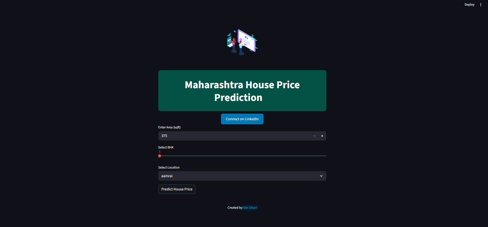

# Maharashtra House Price Prediction

A Machine Learning based web application that predicts house prices in Maharashtra based on user inputs such as location, area (sqft), and BHK. The application is built using Streamlit and provides real-time predictions through an interactive interface.

---

## Project Overview

This project uses a trained regression model to estimate property prices across different regions in Maharashtra. It demonstrates the complete machine learning workflow including data preprocessing, model training, and deployment using a web interface.

---

## Tech Stack

- Python
- Pandas
- NumPy
- Scikit-learn
- Streamlit
- Pickle

---

## Features

- Select location from Maharashtra
- Enter area in square feet
- Choose number of BHK
- Instant house price prediction
- Interactive web interface
- Integrated LinkedIn profile button

---

## Dashboard Preview



---

## Project Structure

house_price_prediction_maharashtra/

├── maharashtra_house_price_prediction.py  
├── maharashtra_region_model.pickle  
├── column.json  
├── analysis_data.csv  
├── data_model_cleaning.ipynb  
├── util.py  
├── animation.json  
├── Prediction project photo.png  
├── requirements.txt  
└── README.md  

---

## Installation and Setup

### 1. Clone the repository

```bash
git clone https://github.com/your-username/house-price-prediction-maharashtra.git
cd house-price-prediction-maharashtra


### **2. Install Dependencies**
```bash
pip install -r requirements.txt

### **3. Run the Application**
```bash
python -m streamlit run maharashtra_house_price_prediction.py


